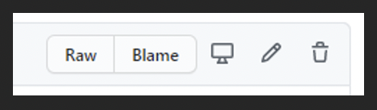
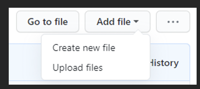
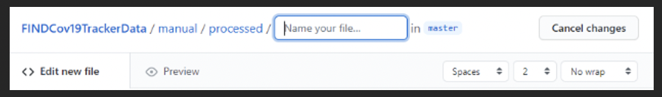
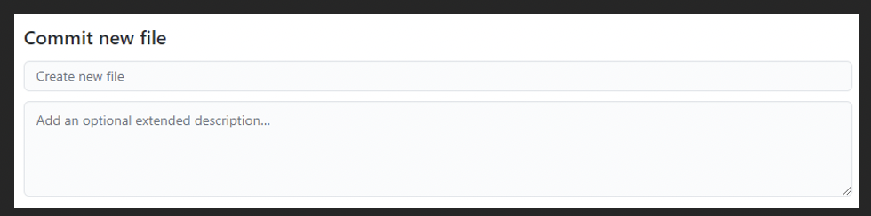
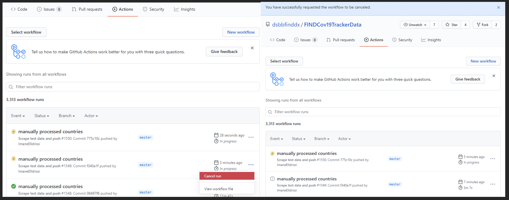
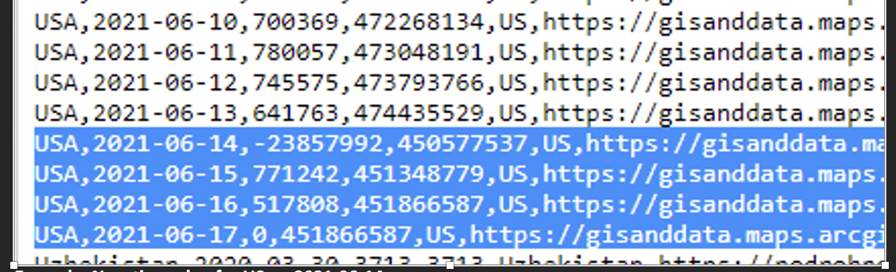

# Manual workflow

## High-level Workflow description

Data is incorporated in the tracker through both, automatic and manual intervention. Automatic data is retrieved using only python (before 2021-05-12 some countries were fetched using also R), and post-processed using R. The scraping process uses different python modules, but Selenium is the module used for most of the countries.

## Folder Structure

- [automated/](https://github.com/dsbbfinddx/FINDCov19TrackerData/tree/master/automated) folder contains all data retrieved.
  - [fetch/](https://github.com/dsbbfinddx/FINDCov19TrackerData/tree/master/automated/fetch) folder contains data retrieved with R before 2021-05-12.
  - [merged/](https://github.com/dsbbfinddx/FINDCov19TrackerData/tree/master/automated/merged) folder incorporated the data from the manual and automated process.
  - [selenium/](https://github.com/dsbbfinddx/FINDCov19TrackerData/tree/master/automated/selenium) folder contains data get from python runs. 
- [issues/](https://github.com/dsbbfinddx/FINDCov19TrackerData/tree/master/issues) includes files describing when there are errors in the data.
- [manual/](https://github.com/dsbbfinddx/FINDCov19TrackerData/tree/master/manual) folder with the files to update data manually.
  - [need-processing](https://github.com/dsbbfinddx/FINDCov19TrackerData/tree/master/manual/need-processing) folder includes the files created every day during the automatic process. Each file in this folder contains the countries that should be gathered manually or when the scrape for some countries failed. 
  - [processed/](https://github.com/dsbbfinddx/FINDCov19TrackerData/tree/master/manual/processed) folder contains for each day a file including the manual changes to the data. Generally, files in [need-processing](https://github.com/dsbbfinddx/FINDCov19TrackerData/tree/master/manual/need-processing) are taken to create the files located in this [processed/](https://github.com/dsbbfinddx/FINDCov19TrackerData/tree/master/manual/processed) folder changing the respective values, but it is possible to include or delete countries depending on the manual updates required. 
- [raw/](https://github.com/dsbbfinddx/FINDCov19TrackerData/tree/master/raw) folder with information related to the countries used mainly in the shinyapp.
- [resurces/](https://github.com/dsbbfinddx/FINDCov19TrackerData/tree/master/resources) contains one file with the URLs with the sources and files for massive updates of data.
- [selenium/](https://github.com/dsbbfinddx/FINDCov19TrackerData/tree/master/selenium) includes the files for the automated scrape in python.

## Manual updates process

Manual intervention can be done using both the [need-manual-processing](https://github.com/dsbbfinddx/FINDCov19TrackerData/tree/master/manual/need-processing) and [processed-manually](https://github.com/dsbbfinddx/FINDCov19TrackerData/tree/master/manual/processed) files. This data will then be merged with the automated data in the [merged/](https://github.com/dsbbfinddx/FINDCov19TrackerData/tree/master/automated/merged) folder.

Every day, after the first workflow run in the morning, a `YYYY-MM-DD-need-manual-processing.csv` file is created. This file contains all the countries for which manual intervention is needed and is located in the [manual/need_processing](https://github.com/dsbbfinddx/FINDCov19TrackerData/tree/master/manual/need-processing) folder. 

### Steps to follow to update manual countries

There are different ways to update the manual files. Below are the steps to update them using only GitHub website. 

1. Open the [manual/need_processing](https://github.com/dsbbfinddx/FINDCov19TrackerData/tree/master/manual/need-processing) folder.
2. Open on GitHub website the daily file to be updated `YYYY-MM-DD-need-manual-processing.csv`.
3. Click on “Edit this file” on the top right. 

4. Select all data in the file and copy.
5. Go to [manual/processed/](https://github.com/dsbbfinddx/FINDCov19TrackerData/tree/master/manual/processed) folder.
6. Create a new file by clicking on “Add file” on the top right and “Create new file”. 

7. In the empty new file, paste the copied data taken from  `YYYY-MM-DD-need-manual-processing.csv` file. 
8. Name the file with the respective date as `YYYY-MM-DD-processed-manually.csv`. 

9. In the comment box at the bottom of the page write “manually processed countries” instead of “Create new file”. You can also add a specific description to help you track your modifications in the future (ex: "manually processed countries for 2022-01-01", “manually processed countries corrected the negative value for South Africa” or “ manually processed countries updated the cumulative values of Poland and Uruguay”). 

10. Update the column(s) to be updated. 
	- Most of the updates will be to change the `NA` value in `tests_cumulative` and put the new cumulative value found in the corresponding country website and `NA` instead of `0` for `new_tests`. Once the file will be pushed, `new_tests`, `tests_cumulative_corrected` and `new_tests_corrected` will be updated accordingly after pushing the file. Automatic calculations are not visible in this file.
	- It is also possible to update only `new_tests` values instead of `tests_cumulative` values if this is how the country reports the testing data. `tests_cumulative` will also be populated accordingly. 
	- You can also correct negative values. See next section for explanation.
12. Commit the file by clicking on “Commit new file” at the bottom of the page. **Important:** If you want to change many files the process implies several commits. If you commit with less than 20 minutes between each commit you need to cancel the Actions created with each of them, and only leave the last one running. To do so, go to the “Actions” tab at the top of the webpage and cancel all the runs (except the last one), by clicking on the three dots on the right of the run. If you do not that the process might fail. If the last action fails, you can wait until all actions are finished, and then re-run the last action clicking on re-run all jobs. 

### How to handle negative values

Negative values are visible in the [issues/](https://github.com/dsbbfinddx/FINDCov19TrackerData/tree/master/issues) folder in the `all-countries-error.csv file`. This file is updated after each automatic workflow run and each time a YYYY-MM-DD-processed-manually.csv is pushed. 
Negative values will appear in both original columns and corrected columns. Original columns should reflect exactly what countries report. Corrected columns are the columns used for the tracker, we do not want to show negative values in the tracker as it does not make sense. Corrected columns should thus never display a negative value. If the negative value is due to a mistake from the reporting of the country itself, the value should stay in the original column and only be corrected in the corrected column. If the negative value is due to an error in the scraping or a manual intervention, it should be corrected in both columns.
When a negative value appears, the tracker ignores and continues showing the last value prior to the negative values until the value is corrected by manual intervention.

Example: Negative value for US on 2021-06-14

The correction must be made on the 2021-05-17 as, the 2021-05-16 has the last value which is smaller than 450577537 (value of the 2021-06-14, giving the negative value).
Each YYYY-MM-DD-processed-manually.csv file from 2021-05-17 to 2021-06-13 must be corrected as follows: i. leave original columns as they are since it is the way US reported its data, and ii. correct corrected columns by putting 450444193 for every day.

Steps:
1. Open the [all-countries-error](https://github.com/dsbbfinddx/FINDCov19TrackerData/blob/master/issues/all-countries-error.csv).csv file.
Before correcting negative values, it is important to check previous values of the country to correctly identify which value(s) has to be changed. It happens often that the value to be changed is not in the date giving the negative value but earlier. This check can be done in the [processed/coronavirus_tests.csv](https://github.com/dsbbfinddx/FINDCov19TrackerData/blob/master/processed/coronavirus_tests.csv) file.
2. In another tab open the `coronavirus_tests.csv` file which is in [processed/coronavirus_tests.csv](https://github.com/dsbbfinddx/FINDCov19TrackerData/blob/master/processed/coronavirus_tests.csv). Click on it and click “View raw”. This file is also updated after each automatic workflow run and each time a `YYYY-MM-DD-processed-manually.csv` is pushed. You can use the Ctrl+F to highlight all the dates of the country of interest. You should check which values do not make sense to identify which date should be modified.
3. Once you know which date has to be modified, go to the [manual/processed/](https://github.com/dsbbfinddx/FINDCov19TrackerData/tree/master/manual/processed) folder and open the corresponding file. It is in the `YYYY-MM-DD-processed-manually.csv` files that negative values should be corrected, and not in the `all-countries-error.csv`. You may need to modify several dates, meaning several `YYYY-MM-DD-processed-manually.csv` files. In this case, do not forget to cancel the actions and leave only the last action running. 

