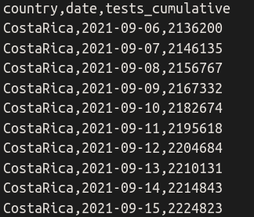
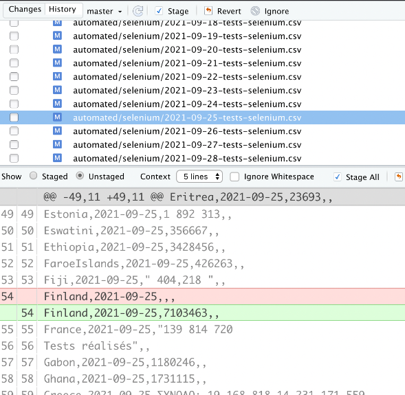

# Steps for bulky update

1.  Located in the repo [FINDCov19TrackerData](https://github.com/finddx/FINDCov19TrackerData), you can find a [resources folder](https://github.com/finddx/FINDCov19TrackerData/tree/master/resources). In that folder you should create a csv with the data you want to update (see [example file for Costa Rica](https://github.com/finddx/FINDCov19TrackerData/blob/master/resources/update_CostaRica.csv)). 

**Structure of the csv file with the data to update**
The file should contain the following three columns in the same order as listed below:

- `country`: use the name of the country as listed in the column `jhu_ID` (second column) from [this file](https://github.com/finddx/FINDCov19TrackerData/blob/master/resources/countries-urls.csv).
- `date`: use the format YYYY-MM-DD
- `tests_cumulative`: value without commas or points.
  
{width=35%}

**Note:** You cannot update data prior to 2021-02-19.

2.  Load or run the functions to update the values included in the script [resources/bulky_update.R](https://github.com/finddx/FINDCov19TrackerData/blob/master/resources/bulky_update.R):

With the [repo](https://github.com/finddx/FINDCov19TrackerData) project open in Rstudio you can run:

`source("resources/bulky_update.R")`

3.  Use the functions to modify the [automated files](https://github.com/finddx/FINDCov19TrackerData/tree/master/automated/selenium) and the [manually processed files](https://github.com/finddx/FINDCov19TrackerData/tree/master/manual/processed). You should specify the dates for which you want to update the data by giving the initial date and the final date.

**Note:** You should not include the current day because it will be modified after the automated run at night.

  a.  Function to update selenium files with the new values
  
  ```
  update_selenium_with_file(f_date = "2021-09-06",
                            e_date = "2022-01-19",
                            country_update = "CostaRica",
                            country_update_path = "resources/update_CostaRica.csv")
  ```
  
  b. Function to delete values from manual files in case there were manual updates for the dates specified.
  
  ```
  delete_country_manual_f(f_date = "2021-09-06",
                          e_date = "2022-01-19",
                          country_update = "CostaRica")
  ```
  
**Tip:** Before you commit your changes, check that only the files corresponding to the dates and the lines corresponding to the country changed.

{width=40%}
